# Lab 2.4 

## Metodologi SDLC
Metodologi Agile (Kanban)

## Alasan Pemilihan Metodologi
1.	Tahap pengembangan yang Adaptif dan Fleksible
   Dalam industri kesehatan dan kebugaran, tren dan penemuan baru sering muncul, Kanban memungkinkan kami untuk menyesuaikan prioritas dan fitur pada tahap pengembangan secara mudah tanpa mengganggu keseluruhan proyek.
2.	Visualisasi Alur Kerja yang Jelas
   Dengan visualisasi alur kerja yang jelas, Kanban memungkinkan kami untuk mengetahui status setiap tugas dengan jelas, siapa yang bertanggung jawab, dan dimana bottleneck yang mungkin terjadi.
3. Baik untuk Kolaborasi Tim
   Metodologi Kanban mendorong kolaborasi yang kuat dari setiap anggota dari tim yang memastikan bahwa semua aspek dari web sesuai dengan standar yang diingkan dan kami dapat memastikan semua anggota terlibat.

## Tujuan Produk
1.	Meningkatkan kesadaran kesehatan mental dengan menyediakan platform yang mudah diakses dan informatif.
2.	Membantu pengguna mengelola emosi dan stress secara efektif melalui fitur-fitur seperti input mood dan rekomendasi tindakan, artikel interaktif tentang teknik relaksasi dan meditasi, serta pemantauan mood dan jurnaling.
3.	Meningkatkan kualitas hidup pengguna dengan memberikan dukungan, sumber daya dan layanan yang diperlukan untuk menjaga kesehatan mental pengguna secara holistik.

## Pengguna Potensial dan Kebutuhan Pengguna
1. **Individu dengan Masalah Kesehatan Mental** \
   **Kebutuhan: Dukungan emosional dan psikologi**
   
   Menurut Riset Kesehatan Dasar, sekitar 20% populasi Indonesia memiliki potensi-potensi masalah kesehatan jiwa. Namun, belum semua provinsi memiliki rumah sakit dengan tenaga profesional yang dapat menangani masalah kesehatan mental. Sehingga aplikasi ini bisa membantu semua kalangan masyarakat.
2. **Tenaga Profesional** \
   **Kebutuhan: Platform penghubung dengan pasien**
   
   Psikolog, psikiater, konselor, atau terapis yang ingin memperluas jangkauan layanan mereka dengan menyediakan konseling online dan sumber daya tambahan kepada klien mereka. Aplikasi Wellness Whale dapat membantu menghubungkan tenaga profesional dengan calon – calon pasiennya.
3. **Masyarakat Umum yang Peduli dengan Kesehatan Mental** \
   **Kebutuhan: Pengetahuan lebih lanjut mengenai kesehatan mental**
   
   Dewasa ini, masyarakat menjadi lebih tertarik untuk menjaga kesehatan mental mereka sendiri ataupun mendukung orang-orang di sekitar mereka dalam perjalanan kesehatan mental. Aplikasi ini dapat menjadi informan yang akurat dan terpercaya tentang kesehatan mental serta memberi solusi untuk mengelola kondisi mereka dengan baik.

## Use Case Diagram
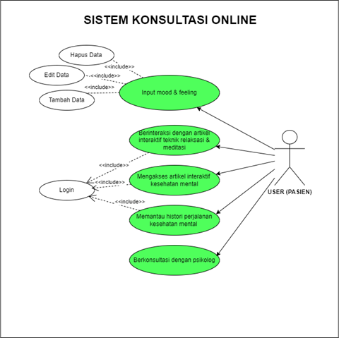

## Functional Requirements

| Requirement ID | Requirement Description |
|---|---|
| FR-1 | Sistem harus memungkinkan pengguna untuk membuat akun baru |
| FR-2 | Pengguna harus dapat login ke dalam sistem menggunakan email dan password |
| FR-3 | Pengguna harus dapat berinteraksi dengan artikel interaktif teknik relaksasi dan meditasi |
| FR-4 | Pengguna harus dapat mengakses artikel interaktif kesehatan mental |
| FR-5 | Pengguna harus dapat memantau histori perjalanan kesehatan mental |
| FR-6 | Pengguna harus dapat berkonsultasi dengan psikolog |
| FR-7 | Pengguna harus dapat memasukkan mood dan feeling yang sedang dirasakan |
| FR-8 | Pengguna harus dapat menambahkan, mengubah, dan menghapus data yang berkaitan dengan mood dan feeling yang dimasukkan |

## Entity Relationship Diagram

## Arsitektur Sistem
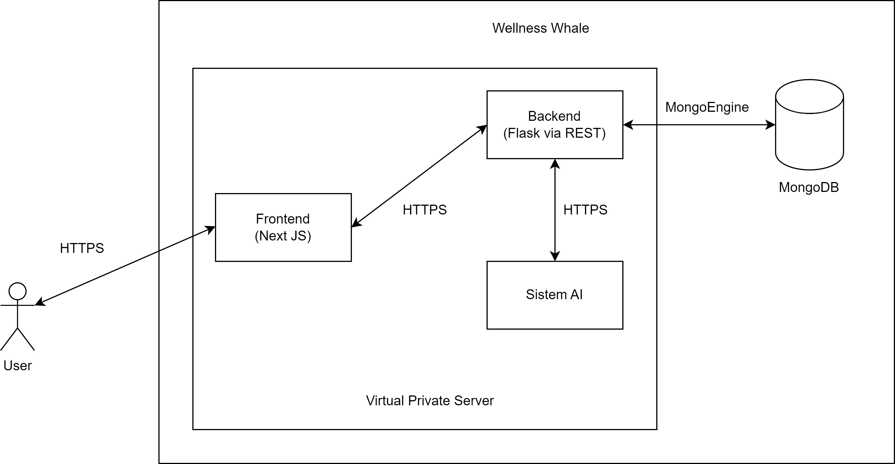

## Low Fidelity Wireframe
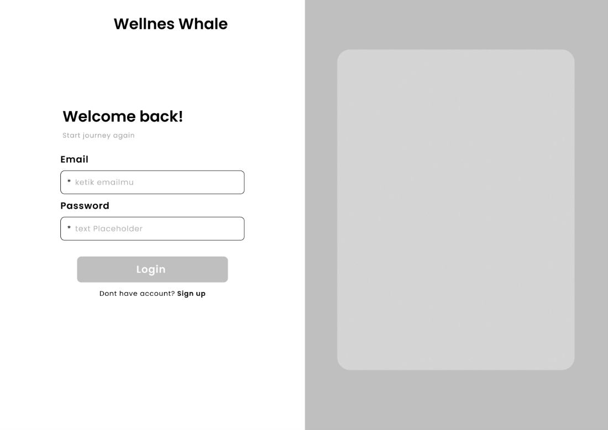 \
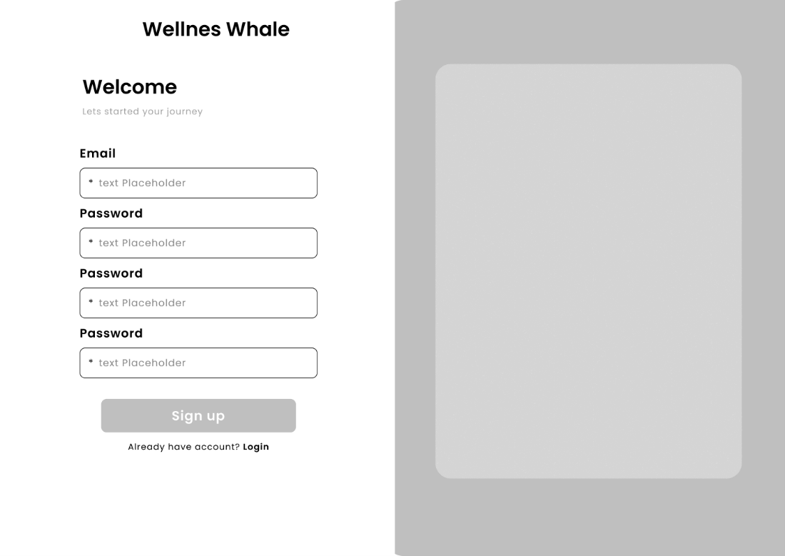 \
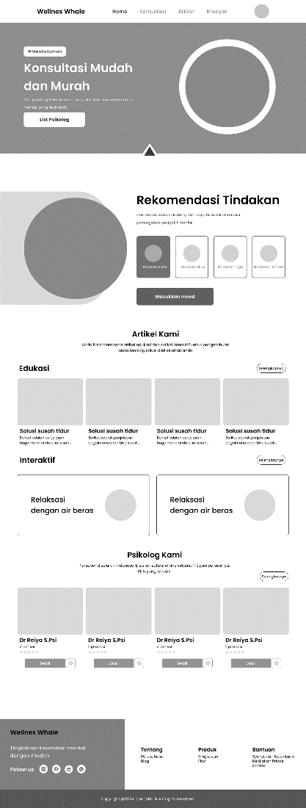 \
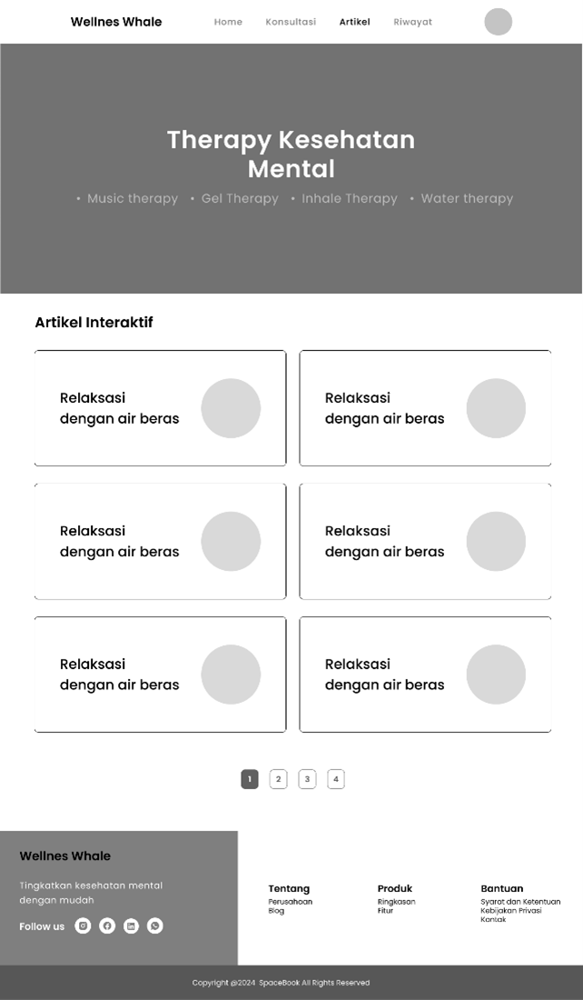 \
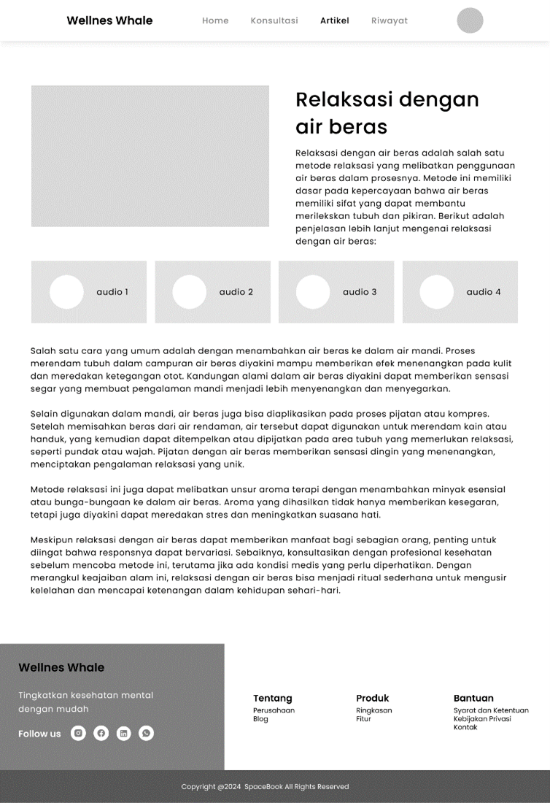 \
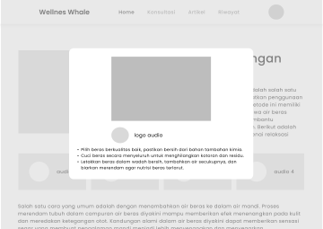 \ 
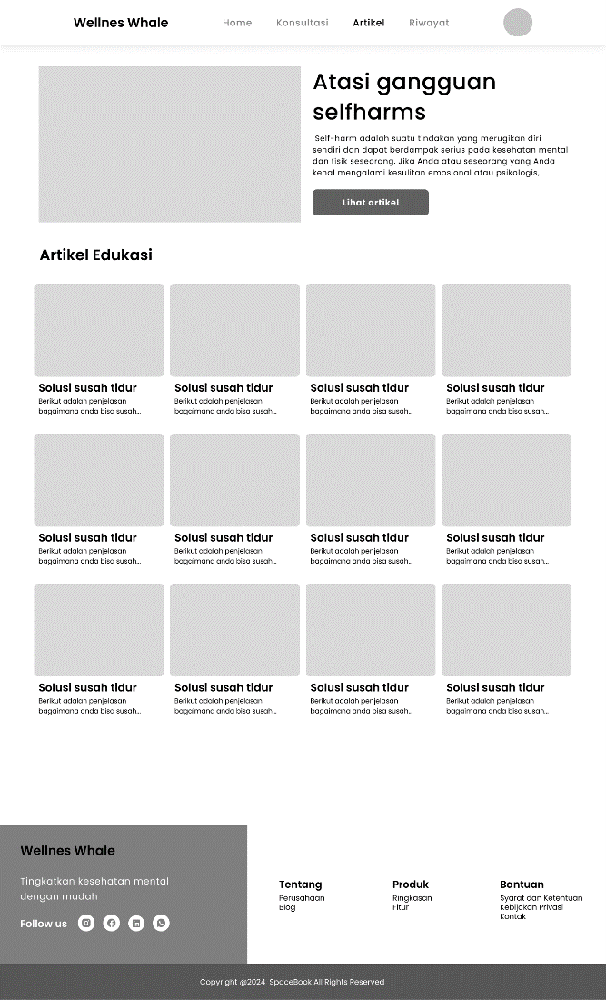 \
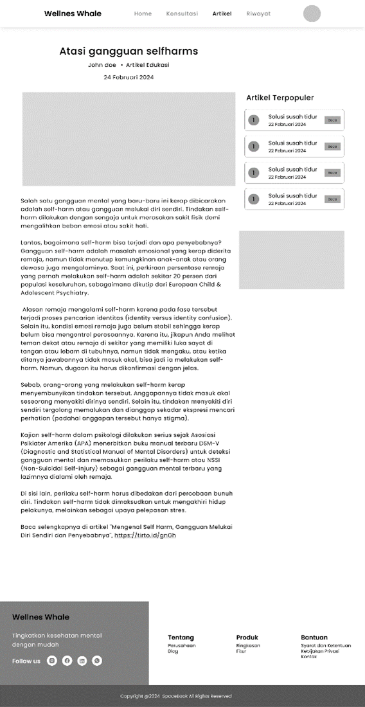 \
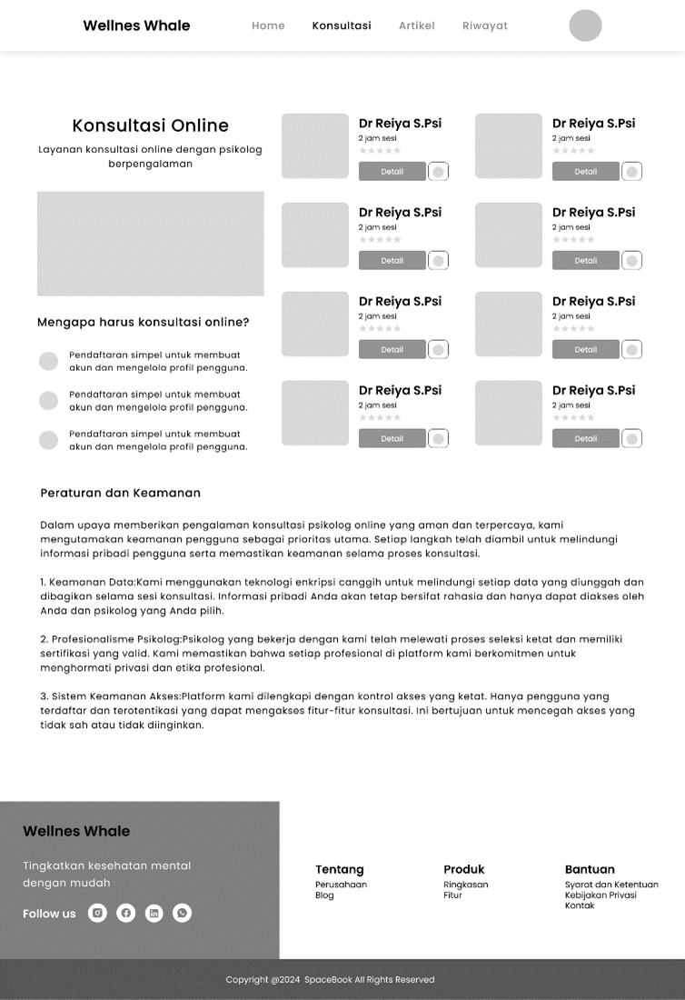 \
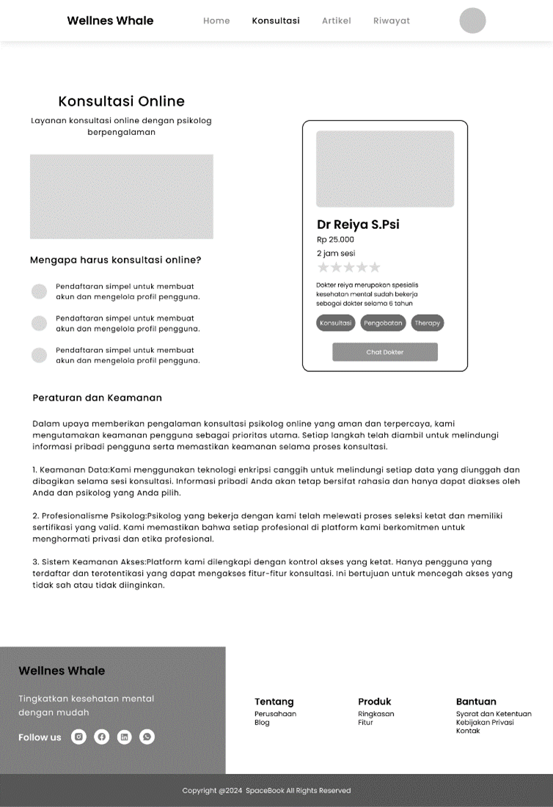 \ 
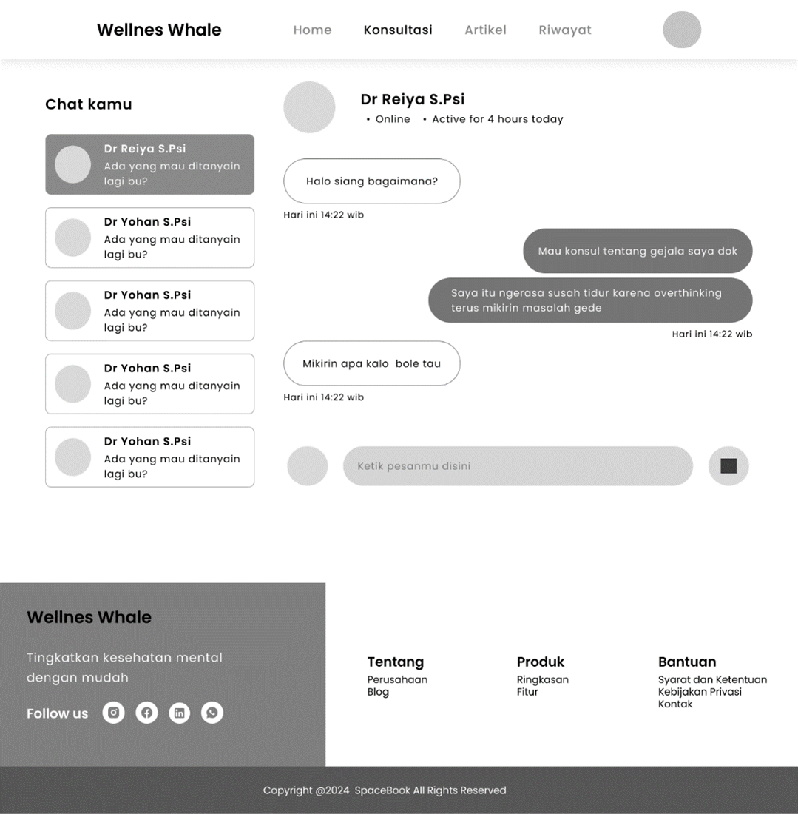 \
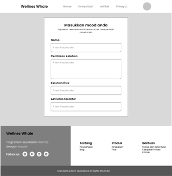 \
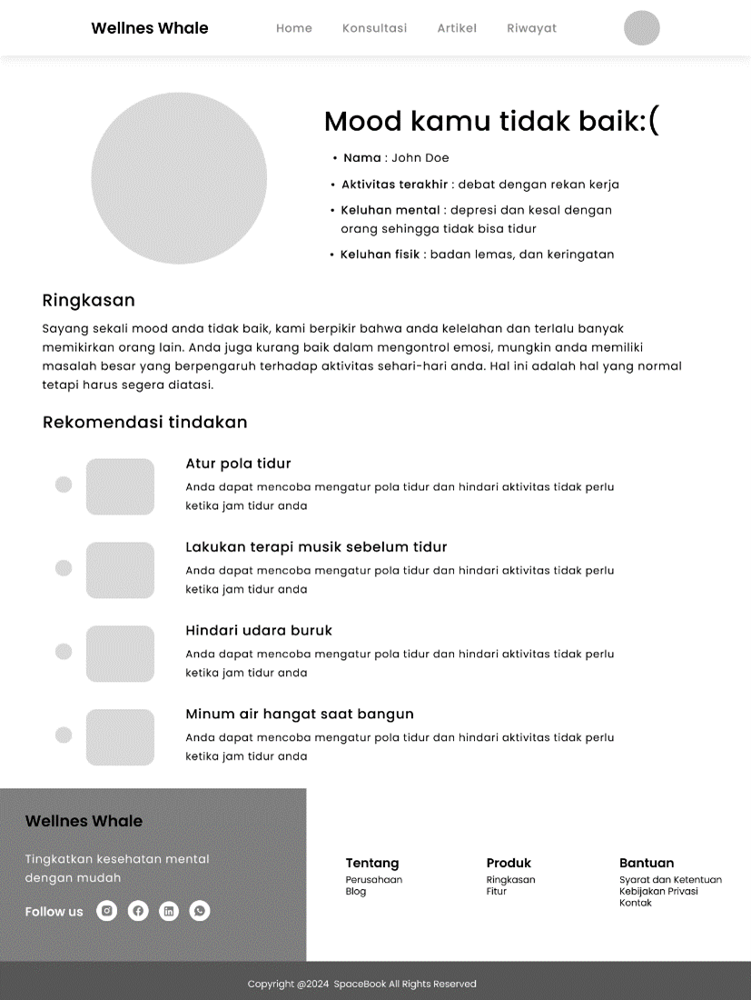 \
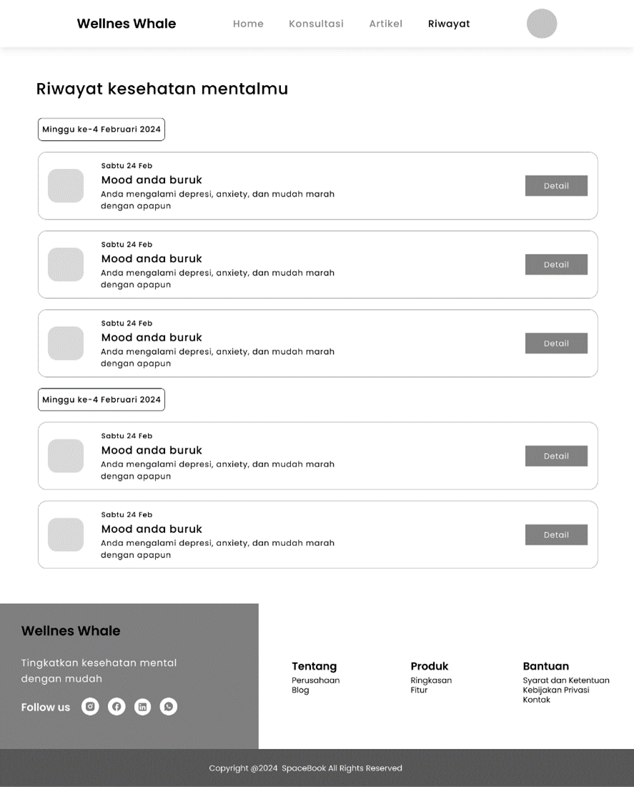 \
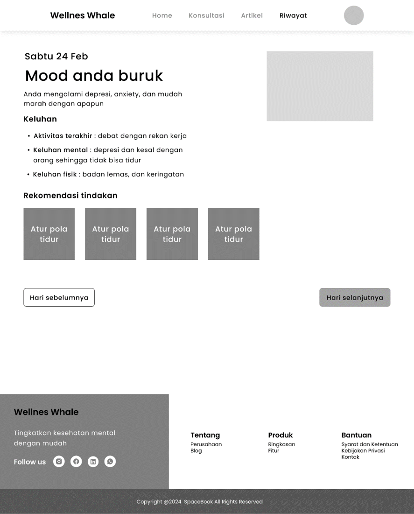

## Gantt-Chart

| Kegiatan | 1 | 2 | 3 | 4 | 5 | 6 | 7 | 8 | 9 | 11 | 11 | 12 | 
|---|---|---|---|---|---|---|---|---|---|---|---|---|
| Brainstorming | X | X | X | X |  |  |  |  |  |  |  |  |
| Design and Wireframing |  | X | X | X |  |  |  |  |  |  |  |  |
| Development |  |  |  | X | X | X | X |  |  |  |  |  |
| Testing and Quality Assurance |  |  |  |  |  |  |  | X | X | X |  |  |
| Deployment |  |  |  |  |  |  |  |  |  |  | X |  |
| Launch |  |  |  |  |  |  |  |  |  |  | X |  |
| Review |  |  |  |  |  |  |  |  |  |  |  | X |
