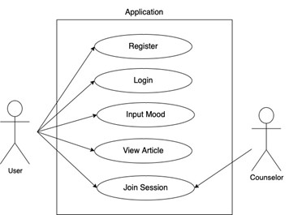
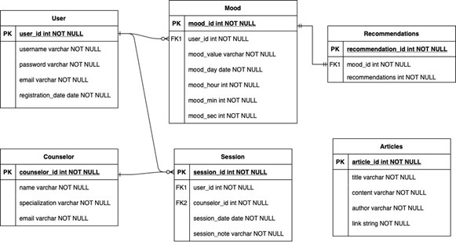

# Lab 2.4 

## Tujuan Produk
1.	Meningkatkan kesadaran kesehatan mental dengan menyediakan platform yang mudah diakses dan informatif.
2.	Membantu pengguna mengelola emosi dan stress secara efektif melalui fitur-fitur seperti input mood dan rekomendasi tindakan, artikel interaktif tentang teknik relaksasi dan meditasi, serta pemantauan mood dan jurnaling.
3.	Meningkatkan kualitas hidup pengguna dengan memberikan dukungan, sumber daya dan layanan yang diperlukan untuk menjaga kesehatan mental pengguna secara holistik.

## Pengguna Potensial dan Kebutuhan Pengguna
1. **Individu dengan Masalah Kesehatan Mental** \
   **Kebutuhan: Dukungan emosional dan psikologi**
   
   Menurut Riset Kesehatan Dasar, sekitar 20% populasi Indonesia memiliki potensi-potensi masalah kesehatan jiwa. Namun, belum semua provinsi memiliki rumah sakit dengan tenaga profesional yang dapat menangani masalah kesehatan mental. Sehingga aplikasi ini bisa membantu semua kalangan masyarakat.
2. **Tenaga Profesional** \
   **Kebutuhan: Platform penghubung dengan pasien**
   
   Psikolog, psikiater, konselor, atau terapis yang ingin memperluas jangkauan layanan mereka dengan menyediakan konseling online dan sumber daya tambahan kepada klien mereka. Aplikasi Wellness Whale dapat membantu menghubungkan tenaga profesional dengan calon – calon pasiennya.
3. **Masyarakat Umum yang Peduli dengan Kesehatan Mental** \
   **Kebutuhan: Pengetahuan lebih lanjut mengenai kesehatan mental**
   
   Dewasa ini, masyarakat menjadi lebih tertarik untuk menjaga kesehatan mental mereka sendiri ataupun mendukung orang-orang di sekitar mereka dalam perjalanan kesehatan mental. Aplikasi ini dapat menjadi informan yang akurat dan terpercaya tentang kesehatan mental serta memberi solusi untuk mengelola kondisi mereka dengan baik.

## Use Case Diagram

## Functional Requirements
**On Progress**

## Entity Relationship Diagram

## Low Fidelity Wireframe
**On Progress**

## Gantt-Chart
| Kegiatan | 1 | 2 | 3 | 4 | 5 | 6 | 7 | 8 | 9 | 11 | 11 | 12 | 
|---|---|---|---|---|---|---|---|---|---|---|---|---|
| Brainstorming | X | X | X | X |  |  |  |  |  |  |  |  |
| Design and Wireframing |  | X | X | X |  |  |  |  |  |  |  |  |
| Development |  |  |  | X | X | X | X |  |  |  |  |  |
| Testing and Quality Assurance |  |  |  |  |  |  |  | X | X | X |  |  |
| Deployment |  |  |  |  |  |  |  |  |  |  | X |  |
| Launch |  |  |  |  |  |  |  |  |  |  | X |  |
| Review |  |  |  |  |  |  |  |  |  |  |  | X |

